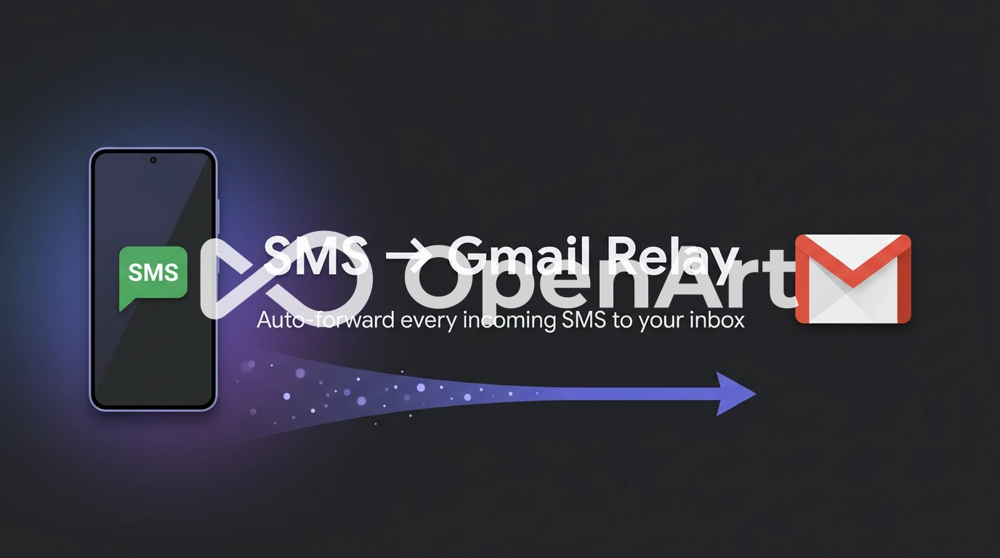

<p align="center">
  
</p>

# SMS → Gmail Forwarder (Android, personal use)

Forwards **every incoming SMS** to your Gmail inbox using **direct SMTP** —
no backend server. Built for a **sideloaded APK on your own phone**, not the
Play Store.

For each SMS it captures the **sender number**, **body**, and **received time**,
then emails:

```
Subject: New SMS from {sender}
Body:
  From: {sender}
  Time: {timestamp}
  Message:
  {body}
```

It keeps working when the app is closed, swiped from recents, and after reboot.

---

## File tree

```
sms_send_gmail/
├── pubspec.yaml
├── analysis_options.yaml
├── README.md
├── android/
│   └── app/
│       ├── build.gradle.kts                  # SDK versions (merge into generated)
│       └── src/main/
│           ├── AndroidManifest.xml           # permissions, receivers, service
│           └── kotlin/com/northernwolf/relay/
│               └── MainActivity.kt
└── lib/
    ├── main.dart                             # app init, permissions, bootstrap
    ├── models/
    │   ├── app_settings.dart                 # credentials in SharedPreferences
    │   └── sms_log_entry.dart                # log/queue model + JSON
    ├── services/
    │   ├── permission_service.dart           # runtime permission requests
    │   ├── email_service.dart                # mailer / smtp.gmail.com:587
    │   ├── log_service.dart                  # rolling 50-entry log
    │   ├── queue_service.dart                # offline retry queue
    │   ├── sms_handler.dart                  # core pipeline + bg handler
    │   └── service_controller.dart           # start/stop + SMS listener
    ├── foreground/
    │   └── foreground_task_handler.dart      # keeps process alive + retries
    └── screens/
        ├── home_screen.dart                  # status + log of last 50
        └── settings_screen.dart              # Gmail config + test email
```

---

## How it works

- **Reception:** `another_telephony` registers an incoming-SMS listener with a
  top-level `@pragma('vm:entry-point')` background handler
  (`backgroundMessageHandler` in `sms_handler.dart`). Android's broadcast
  receiver wakes a background Dart isolate for each SMS, even when the app is
  closed.
- **Staying alive:** `flutter_foreground_task` runs a low-priority foreground
  service so aggressive OEM task-killers don't stop the process. Every 60s it
  also flushes the retry queue.
- **Reboot:** the foreground task is configured with `autoRunOnBoot: true`; its
  `RebootReceiver` (declared in the manifest, listening for `BOOT_COMPLETED`)
  restarts the service after reboot.
- **Email:** `mailer` connects to `smtp.gmail.com:587` (STARTTLS) using your
  Gmail address + a 16-char **App Password**.
- **Reliability:** if offline or SMTP fails, the SMS is queued in
  SharedPreferences and retried when `connectivity_plus` reports a connection.
  Every forward is recorded in a 50-entry on-device log with status
  (sent / queued / failed).

Credentials (Gmail address, App Password, recipient) are entered on the
**Settings** screen and stored in **SharedPreferences** — never hardcoded.

> ⚠️ **Security:** the App Password is stored in plain SharedPreferences on this
> device and sent directly to Gmail's SMTP. This is acceptable **only** for a
> personal app you build and sideload yourself. Do not distribute it. You can
> revoke the App Password anytime from your Google Account.

---

## Setup

### 1. Create a Gmail App Password
1. Turn on **2-Step Verification**: Google Account → Security → 2-Step
   Verification.
2. Go to **App passwords**: Google Account → Security → 2-Step Verification →
   **App passwords** (or https://myaccount.google.com/apppasswords).
3. Choose *Mail* / *Other (Custom name)*, name it `SMS Forwarder`.
4. Copy the **16-character** password shown (e.g. `abcd efgh ijkl mnop`).
   You'll paste it into the app's Settings screen.

### 2. Get dependencies
The full Android scaffold (gradle wrapper, manifest, `MainActivity.kt`) is
already in this repo with the application id `com.northernwolf.relay`. Just
fetch packages:

```bash
cd relay          # or whatever you named the clone folder
flutter pub get
```

> Requires Flutter (latest stable) + Android SDK. Verify with `flutter doctor`.

### 3. Build the APK
```bash
flutter build apk --release
```
Output: `build/app/outputs/flutter-apk/app-release.apk`

### 4. Install on your phone
Either:
```bash
flutter install            # with phone connected via USB + debugging on
# or
adb install build/app/outputs/flutter-apk/app-release.apk
```
Or copy the APK to the phone and open it (enable "Install unknown apps" for your
file manager).

### 5. Configure & start
1. Launch the app, accept the permission prompts (SMS, notifications, disable
   battery optimization).
2. Open **Settings**, enter your Gmail address, the App Password, and the
   recipient email.
3. Tap **Send test email** — confirm it arrives.
4. Flip **Forwarding service** on. The Home screen should show *Service running*.
5. Send yourself a text to verify it forwards.

---

## OEM battery / autostart settings (important!)

Stock Android usually "just works". Xiaomi/Huawei/Oppo/Vivo/Samsung aggressively
kill background apps — enable these **manually**, or forwarding stops when the
screen is off / app is swiped:

- **All devices:** Settings → Apps → *SMS to Gmail* → Battery →
  **Unrestricted / Don't optimize**.
- **Xiaomi (MIUI/HyperOS):** Security app → Permissions → **Autostart** → enable
  for this app. Also Settings → Apps → *SMS to Gmail* → **Battery saver →
  No restrictions**, and lock the app in Recents (swipe down on its card → lock).
- **Huawei:** Settings → Apps → *SMS to Gmail* → Battery → **App launch** →
  turn OFF "Manage automatically", then enable *Auto-launch*, *Secondary
  launch*, *Run in background*. Add to **Protected apps**.
- **Oppo/Realme/Vivo (ColorOS/FuntouchOS):** enable **Autostart**; Battery →
  **Allow background activity / High background power**; lock in Recents.
- **Samsung (One UI):** Settings → Battery → **Background usage limits** →
  remove the app from "Sleeping apps" and add to **Never sleeping apps**.

Also keep **Notifications** enabled for the app — the foreground service requires
its persistent notification to stay alive.

---

## Troubleshooting

- **Test email fails with auth error:** you used your normal password — use the
  16-char **App Password**, and make sure 2-Step Verification is on.
- **No SMS forwarded while app closed:** OEM killed the process — apply the
  battery/autostart settings above and keep the service toggle on.
- **Manifest merge error about a duplicate SMS receiver:** delete the explicit
  `<receiver ...IncomingSmsReceiver>` block in `AndroidManifest.xml`; the plugin
  registers its own.
- **Messages show "queued":** device was offline or SMTP failed; they retry
  automatically every ~60s once back online.
```
